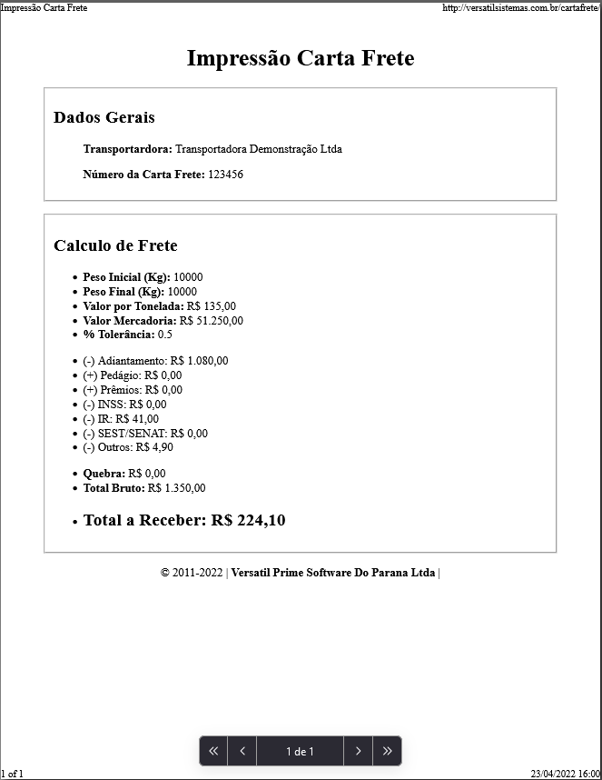

<h1 align="center" style="margin: 30px 0;" id="title">
    Carta Frete - Versátil Prime 
</h1> 

<a href="https://renatolira-conversormoedas.netlify.app/">Aplicativo ONLINE Clique para acessar!</a> 

<h4 align="center">
  Aplicativo Web para auxiliar no cálculo de Carta Frete em postos de combustível.
</h4>

## :computer: Tecnologias utilizadas

- HTML5
- CSS3
- JavaScript
- Biblioteca JS SweetAlert 

## :handshake: Colaboradores

- Pessoas envolvidas neste projeto:

<table style="width: 50%">
  <tr>
    <td align="center">
      <a href="https://github.com/buscarato" style="text-decoration: none;">
         
        
          <b>Everton Correa Buscarato</b>
        
      </a>
    </td>
    <td align="center">
      <a href="https://github.com/renatoliradev" style="text-decoration: none;">
         
        
          <b>Renato Lira</b>
        
      </a>
    </td>
  </tr>
</table>

## :white_check_mark: Resultado

  

      
      
      

